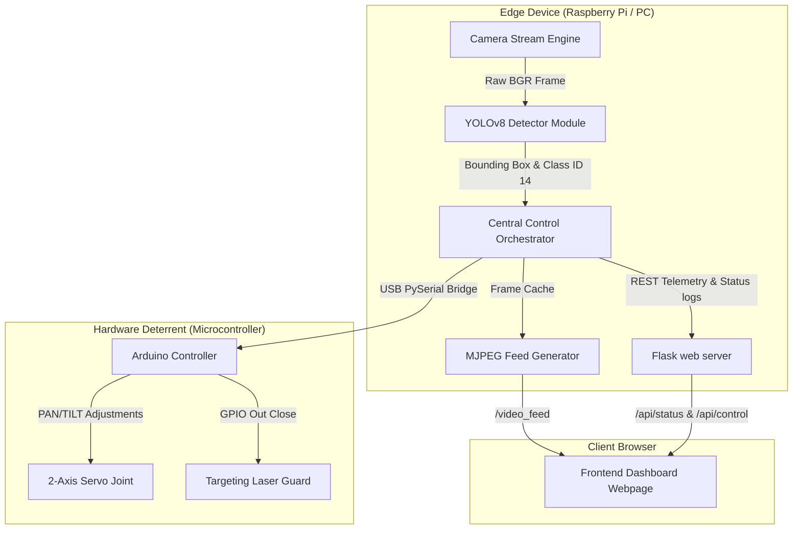

# SmartVision Bird Deterrence System

[](https://python.org)
[](https://opencv.org)
[](https://github.com/ultralytics/ultralytics)
[](https://flask.palletsprojects.com)
[](https://arduino.cc)
[](LICENSE)

An intelligent, real-time edge computing solution utilizing deep learning vision networks and physical microcontrollers to detect and deter birds in agricultural, aviation, and solar energy yards.

Featuring a high-performance **YOLOv8 object detector**, modular **multithreaded Python orchestrator**, and a **glassmorphic telemetry dashboard** complete with diagnostic logging and remote override triggers.

---

## Architecture & Dataflow



---

## Technology Stack & Core Modules

### Backend Stack
*   **Python 3.8+**: Application logical runtime.
*   **OpenCV**: Image transformations, annotations layering, and video I/O.
*   **Ultralytics YOLOv8**: Real-time object recognition (detects class ID 14).
*   **PySerial**: Safe duplex serial communication between processor and hardware.
*   **Flask 3.x**: High-speed REST controller interface & streams routing.

### Frontend HUD Engine
*   **HTML5 / CS3**: Layout built using CSS Custom Grid columns and modern typography (Google Font Inter & Outfit).
*   **Aesthetic Theme**: Dark-mode glassmorphic interface with background blurs, glow pulses, and vector metrics.
*   **ECMAScript 6 (JS)**: Live async polling client to capture logs and pipe manual UI triggers without page reloads.

### Hardware Control Firmware
*   **C++ (Arduino)**: Hardware state machine maintaining sweeping searches and firing physical actuators when serial events flag `BIRD` status.

---

## Hardware Wiring Specification

The physical system uses a Pan/Tilt bracket driven by two standard RC servos, holding a low-power focus laser or sound emitter.

| Component | Arduino Pin | Description |
|-----------|-------------|-------------|
| **Pan Servo** | Pin 9 | Connect Signal line (usually Orange/Yellow) |
| **Tilt Servo** | Pin 10 | Connect Signal line |
| **Laser/Deterrent** | Pin 11 | Connect Gate/Deterrent relay Signal |
| **VCC (Servo)** | 5V / External | Power servos from external source (recommend 5V/2A) |
| **GND** | GND | Common ground must link Arduino and External supply |

---

## Installation & Deployment

### 1. Arduino Sketch Setup
1. Launch Arduino IDE.
2. Open [`arduino/bird_response_controller/bird_response_controller.ino`](file:///c:/Users/NAVDEEP%20RAJ/Downloads/AI_Bird_Detection_Response_System/arduino/bird_response_controller/bird_response_controller.ino).
3. Connect your Arduino board via USB.
4. Verify code compiling and **Upload** sketch to the board.

### 2. Python Workspace Configuration
Create a clean environment and run package loading:

```bash
# Navigate to project root
cd AI_Bird_Detection_Response_System

# Create virtual environment
python -m venv venv

# Activate on Windows
venv\Scripts\activate

# Or Activate on macOS/Linux
source venv/bin/activate

# Install essential dependencies
pip install -r requirements.txt
```

### 3. Execution Options

#### Local PC Testing (Fallback USB Camera Mode)
Ensure PySerial package details point to matching serial COM ports. Running on Windows automatically defaults camera capture to your computer's webcam, allowing you to test the entire system and live dashboard offline:
```bash
# Override local Arduino serial port (e.g. COM3)
set SERIAL_PORT=COM3

# Start the orchestrator
python -m python.app
```

#### Production Deploy (Raspberry Pi Node)
Connect a Pi Camera and configure permissions. The system will leverage native `rpicam-vid` shell streams for high-speed hardware decoding:
```bash
# Point configuration to Unix serial ports
export SERIAL_PORT=/dev/ttyUSB0

# Run service
python -m python.app
```

Once running, navigate to `http://localhost:5000` (or `http://<PI_IP>:5000`) in your browser to view the HUD Dashboard.
